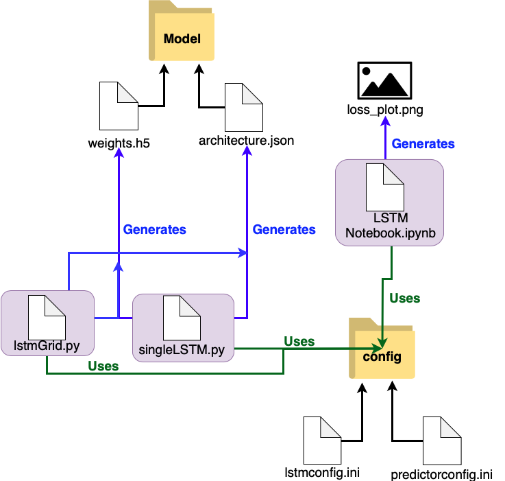

# Anomaly Detection
 LSTM (Long Short Term Memory) Network

## Intsall Requirements to use this repo
In Terminal:

        $ pip install --user --requirements requirements.txt

## Folder Structure
1. **Model** - Folder that contains saved LSTM model architecture and weights. Used in `predictor.py` and `FuturePredictor.py`
2. **config** - Folder that contains:
   
    - `lstmconfig.ini` : used by the `lstmGrid.py`, `singleLSTM.py` and `LSTM Notebook.ipynb` to load variables
    - `predictorconfig.ini` : used by `predictor.py`, `FuturePredictor.py` and `LSTM_Future_Predictor.ipynb` to load variables such as the name of the model's architecture and it's respective weights
3. `LSTM_Generator.ipynb` : Jupyter Notebook used to debug and view the predicitions of a single LSTM model
4. `LSTM_Future_Predictor.ipynb`: Jupyter Notebook used to debug and view the predictions of the LSTM model, the amount forecasted is loaded from `predictorconfig.ini` under **Model's** `forecast` variable.
5. `LSTM_Preictor.ipynb`: Jupyter Notebook used to create a prediction of roughly the last **24hrs** and will output a plot with the `Actual` and `Modeled` points, highlighting any points that exceed a threshold of **15%**  error. (Error: abs(Actual - Predicted)/Actual * 100) 
6. `lstmGrid.py` : script that implements a grid search using  scikit-learn's `GridSearchCV`. **Generates** three files: a pickled object of all the grid search results, the architecture and weights of the best model.
7. `predictor.py` : script used to run the model created by the `lstmGrid.py` script.
8. `singleLSTM_generator.py` : script that iterates over a user specified (**n_jobs** in the `lstmconfig.ini` file) amount of runs and saves the run's epochs vs loss metrics into a plot. **Generates** two additional files from the plot which are, the last run's model architecture along with its weights.
9. `FuturePredictor.py`: script used to generate a prediction that is based on the `forecast` variable (same used in `LSTM_Future_Predictor.ipynb`)

### Simple Folder Structure

